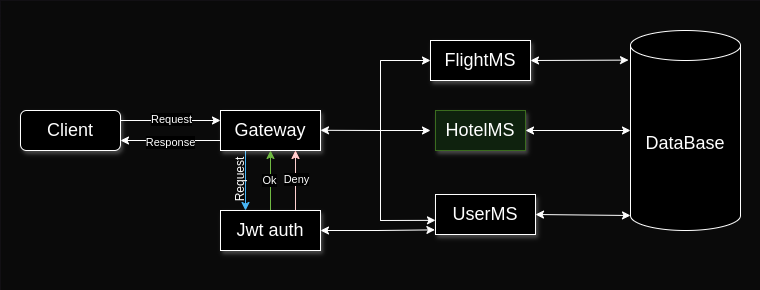

# L-Airline API Rest Project: Hotel Microservice.

This microservice management the Hotel module: persistence and data retrieve.

## Hotel
Have the following data: id, name, city, room type and price per night.

## Exception Handling
Create custom exceptions and handle all exceptions than the project can throw (or I know that can throw), and use the ResponseEntity interface to return a friendly, understandable and explicit message.